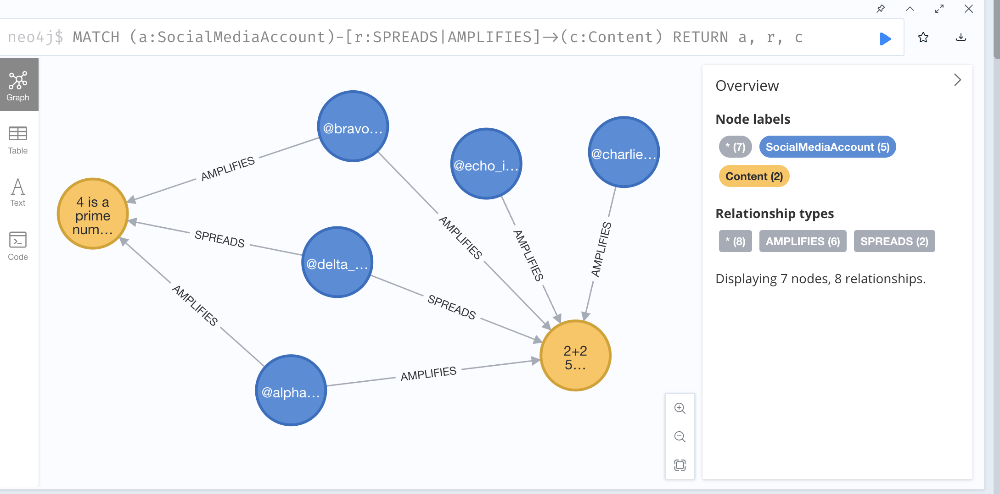

## Neo-4j DEMO

Demo of neo4j to represent disinfo networks

1. Create and activate a virtual environment

```bash
python3 -m venv env
source env/bin/activate
```

2. With the virtual environment activated, install the dependencies
```bash
pip install -r requirements.txt
```

3. Ensure your neo4j installation is running, then run the python script `disinfo_networks.py`. This will create the nodes and relationships


Sample network output

